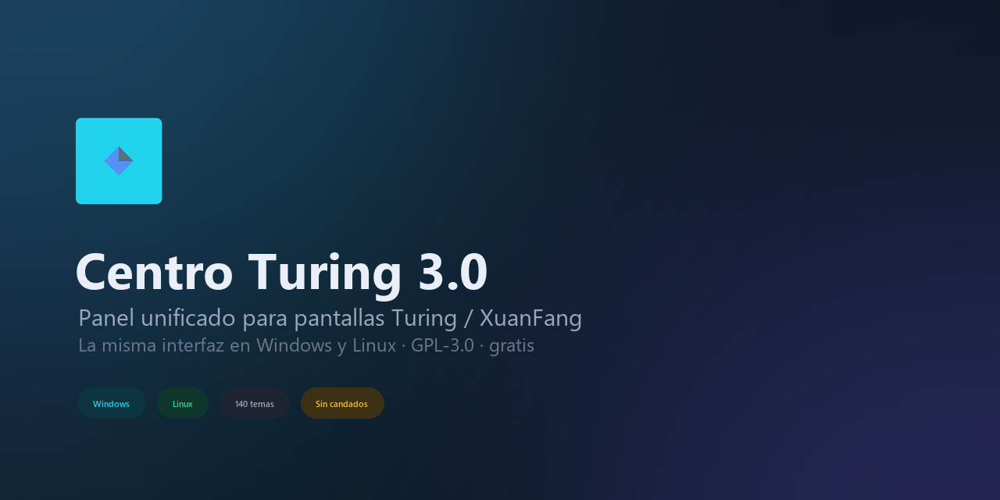

# Turing Smart Screen — Linux / Ubuntu

Versión **1.0.4-linux-ubuntu** — monitor de sistema en mini pantalla USB (Turing 3.5", QinHeng `1a86:5722`, etc.).

> **Repositorio:** [github.com/pilahito/turing-smart-screen-linux](https://github.com/pilahito/turing-smart-screen-linux) — edición mejorada para Linux.

Basado en [turing-smart-screen-python](https://github.com/mathoudebine/turing-smart-screen-python) (GPL-3.0) con mejoras para **Ubuntu 22.04+ / Debian 12+**:

- Arranque automático al iniciar sesión (systemd user + autostart)
- Compatible con **Cinnamon, GNOME, MATE, XFCE** (autostart vía `.desktop` + systemd user)
- Detección USB `/dev/ttyACM*` (QinHeng `1a86:5722`)
- FPS en Linux (`turing-fps.service` → Hz del monitor o MangoHud)
- Ventiladores CPU en placas Gigabyte (`it87` + `force_id=0x8622`)
- GPU NVIDIA: temperatura y uso vía `nvidia-smi` (ventilador GPU si el driver lo expone)
- Selector de **temas ya incluidos** en `res/themes/`
- [Releases](https://github.com/pilahito/turing-smart-screen-linux/releases) con versiones etiquetadas

## Instalación rápida (Ubuntu)

```bash
git clone https://github.com/pilahito/turing-smart-screen-linux.git
cd turing-smart-screen-linux
./scripts/install-ubuntu.sh
```

## Temas incluidos (3.5")

Usa cualquier carpeta de `res/themes/` sin descargar nada extra:

| Tema | Estilo |
|------|--------|
| **Cyberdeck** | Cyberpunk landscape (por defecto) |
| **LandscapeModernDevice35** | Moderno landscape |
| **SimpleCyberpunkGauge** | Gauges cyberpunk |
| **SimpleNeonGauge** / **SimpleFireGauge** | Gauges color |
| **SimpleBlueGauge** / **SimpleRedGauge** / … | Variantes Simple* |
| **Advanced Radials Test** | Radiales de prueba |
| **Cyberpunk** | Portrait 320×480 |

Listar todos:

```bash
./scripts/list-themes.sh 3.5
```

Cambiar tema y reiniciar:

```bash
./scripts/set-theme.sh LandscapeModernDevice35
```

## Centro Turing 3.0 — panel gráfico con interfaz 2026

La misma interfaz gráfica en **Linux y Windows** (Tkinter + Pillow, sin dependencias extra):

```bash
./scripts/turing-center.sh          # abre el panel gráfico
./scripts/turing-center.sh --status # estado en texto, sin GUI
./scripts/turing-center.sh --mockup tmp/mockups   # imágenes de la interfaz, sin abrir ventana
```

Aspecto **2026**: superficies redondeadas con degradado, borde luminoso y sombra; cabecera con
resplandores; iconos vectoriales; tarjetas de estado con mini-gráficas; control segmentado;
interruptores animados; deslizador de brillo arrastrable y transiciones deslizantes entre páginas.
Todo se renderiza con Pillow (`tools/turing_design.py`), así que las imágenes de `--mockup` son
exactamente el mismo diseño que se ve en la aplicación.



### Icono del proyecto

`res/icons/centro-turing.ico` (multirresolución 16→256) y `centro-turing.png` se generan con el
mismo motor de dibujo:

```bash
python -c "import sys; sys.path.insert(0,'tools'); import turing_design as d; from pathlib import Path; \
d.save_app_icon(Path('res/icons/centro-turing.ico'), Path('res/icons/centro-turing.png')); \
d.social_banner(Path('res/docs/centro-turing-banner.png'))"
```

- El panel lo usa como icono de ventana y de barra de tareas automáticamente.
- `res/docs/centro-turing-banner.png` (1280x640) sirve para **GitHub → Settings → Social preview**.

También está en el menú de texto (opción **g**) y, tras `install-desktop-menu.sh`,
como acceso directo **Centro Turing** en el Escritorio y en el menú de aplicaciones.

Qué incluye:

- **Panel**: estado en vivo (encendida/apagada, puerto, brillo, sensores), vista previa del
  tema activo y botones Encender / Apagar / Reiniciar
- **Temas**: catálogo con filtro por medida y orientación, búsqueda instantánea y vista previa
  del fondo antes de aplicar
- **Ajustes**: edita `config.yaml` (tema, sensores, revisión, puerto, brillo, clima) conservando
  comentarios y orden, con copia `.bak-centro` y botón de restaurar
- **Registro**: seguimiento de `/tmp/turing-screen.log` en vivo
- **Sistema**: autostart con un interruptor, módulos de ventiladores, puente de FPS,
  pantalla virtual, diagnóstico y actualización por `git pull`

## Menú en el escritorio

```bash
./scripts/install-desktop-menu.sh
# o doble clic en "Turing Smart Screen" en Escritorio
```

Opciones del menú:
- **Panel gráfico** (Centro Turing 3.0) — opción `g`
- Elegir tema con filtro **landscape / portrait** (41+ temas 3.5")
- **Galería visual** de temas en el navegador
- **Descargar temas** de la comunidad (RedLineGraphs, CpuGpuStatsMono, …)
- **Pantalla virtual** en el PC (modo SIMU + navegador + ventana espejo en DP-0/HDMI-0)
- Reiniciar monitor, log, autostart, ventiladores

> La mini pantalla USB **no es un monitor extendido** de escritorio (limitación del hardware).  
> Sí puedes verla en vivo en tu PC con la opción *Pantalla virtual* del menú.

## Comandos útiles

```bash
./scripts/turing-menu.sh
systemctl --user status turing-smart-screen turing-fps
./scripts/set-theme.sh Cyberdeck
tail -f /tmp/turing-screen.log
sudo ./scripts/install-fan-modules.sh   # ventiladores Gigabyte (una vez)
```

## Requisitos

- Ubuntu 22.04+ / Debian 12+
- Python 3.10+
- Pantalla USB conectada (`lsusb | grep 1a86:5722`)
- Usuario en grupo `dialout` (el instalador lo configura)
- `python3-tk` para el panel gráfico (el instalador ya lo añade; en Arch: `sudo pacman -S tk`)
- Opcional: `lm-sensors` para temperaturas y `python3-pil` para las vistas previas de temas

## Licencia

GPL-3.0 — ver LICENSE. No afiliado a Turing/XuanFang.